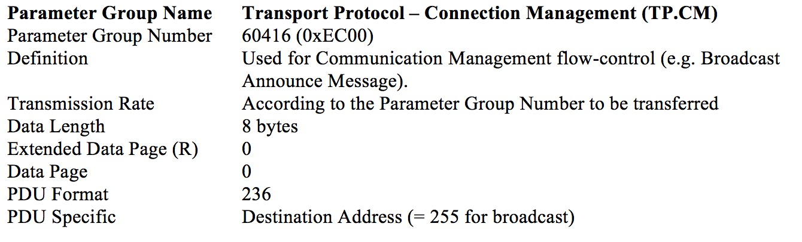
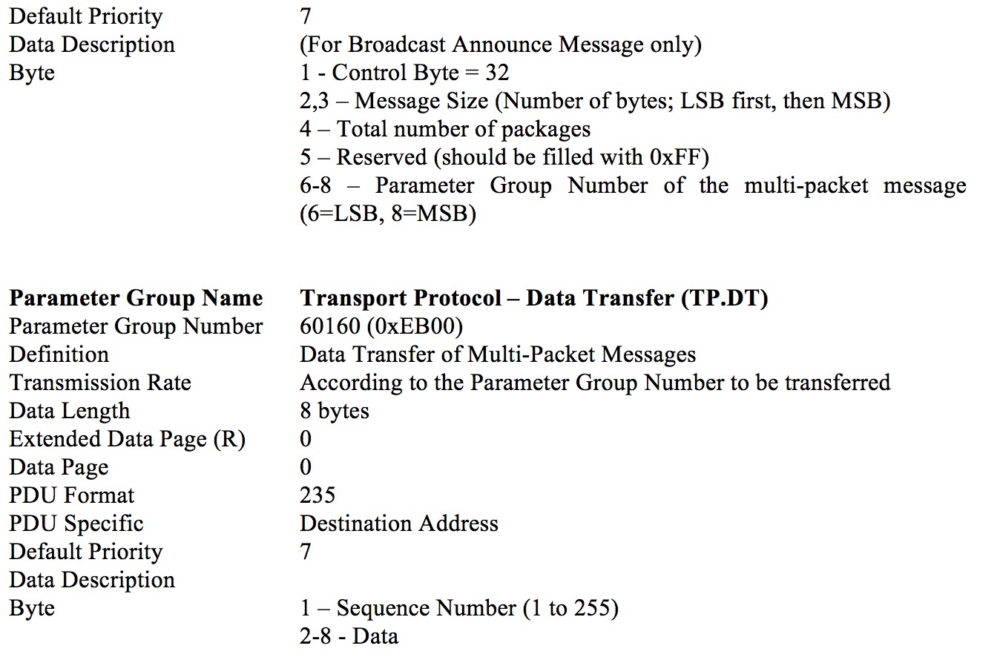
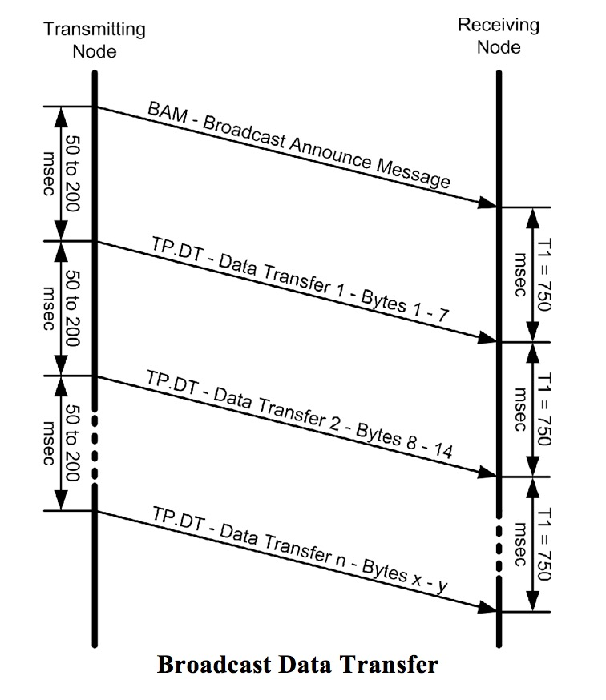

# pstream
pstream is a Packet Stream driver for UART and CAN communication

**DONE:**

* HDLC-like protocol USART Transmitter
* HDLC-like protocol USART Receiver State-machine
* (Draft) CAN-bus Transmitter State-machine
* (Draft) CAN-bus Receiver State-machine

**TODO:**

* Zero-bit-insert/delete functions
* CRC calculations
* CAN-bus State-machine tests
* Thread-safe ring buffer extention (temporary add, reject, commit function)

## pstream over USART

pstream uses HDLC-like protocol for USART communication. 

Except for the SOF and EOF every byte is bit-stuffed by zero-inserting (TODO).

Header consists of size of the rest of packet (including final 0x7E (EOF)).

Tail consists of 2 bytes CRC16 and 1 byte EOF.

### USART Receiver State-machine

- - - 

## pstream over CAN-bus

When pstream uses CAN-bus for communication there is no need of sending CRC explicitly as CAN-bus itseft do this on hardware level.

For short packages pstream uses regular pear-to-pear CAN-package. The first data-byte in payload contains the size of payload (0 -- 7 bytes).

If a packet size is bigger than 7 bytes pstream uses J1939 BAM protocol.
TP_CM package signals Start of Frame and contain number of packages and bytes to be received.
TP_DT packages contain sequence number in the first data-byte and payload in the rest 7 bytes.

### CAN-bus Receiver State-machine

